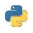

<style>
section {
  font-family: 'Roboto', 'Segoe UI', 'Liberation Sans', 'Helvetica', 'Arial', sans-serif !important;
  font-size: 1.55rem;
  padding: 3.5rem;
  justify-content: start;
}
</style>


<p align="center">
  
</p>


<center>


<br>

<h1 style="font-size: 3.rem"> Основы программирования на Python </h1>

<br>

<h2 style="font-size: 2.rem"> Лекция №1 - Введение в язык Python </h2>

<br>

Вячеслав Алексеевич Чузлов

к.т.н., доцент ОХИ ИШПР ТПУ 

</center>


---

<!-- paginate: true -->

# Язык программирования Python

> **Python** – высокоуровневый язык программирования общего назначения с динамической строгой типизацией и автоматическим управлением памятью, ориентированный на повышение производительности разработчика, читаемости кода и его качества, а также на обеспечение кроссплатформенности написанных на нём программ.

<div class="columns">
<div>

## Установка
- Установить Python (https://www.python.org/). В MacOS X и Linux уже установлен.
- Только для Windows. При установке выбрать опцию с заданием переменных окружения (лучше установить пакет [Anaconda](https://www.anaconda.com/products/individual)).

</div>

<div>

## Среда разработки
- Для обучения, работы с данными и экспериментов с кодом: Jupyter Notebook из пакета [Anaconda](https://www.anaconda.com/products/individual).
- Текстовые редакторы: [Visual Studio Code](https://code.visualstudio.com/), Sublime, Atom, Notepad++ и др.
- IDE (Integrated Development Environment ): [PyCharm (Community Edition)](https://www.jetbrains.com/pycharm/download/#section=windows), Visual Studio, Spyder и др.

</div>

---

# Язык программирования Python

<div class="columns3">
<div>

## Кто использует Python
- Google
- YouTube
- Dropbox
- BitTorrent
- iRobot
- Netflix
- Intel
- Cisco
- NASA

</div>

<div>

## Сильные стороны
- Качество программного кода
- Продуктивность труда
- Кроссплатформенность
- Библиотеки

</div>

<div>


Индекс [TIOBE](https://www.tiobe.com/tiobe-index/) (сентябрь 2024)

<div class="small-text">
<div>

|Позиция|ЯП      |Рейтинг|
|------:|:------ |-------:  |
|1      | Python  |20.17 %|
|2      | C++     |10.75 %|
|3      | Java    |9.45 %|
|4      | C       |8.89 %|
|5      | C#    |6.08 %|

</div>
</div>

---

<style scoped>
  section {
    justify-content: center;
    font-size: 30px;
  }
</style>


# Типы данных


<!-- _paginate: skip -->

---

# Классификация объектов

Основные типы объектов в Python

<center>

|Тип объекта | Категория| Изменяемый? |
|-|-|-|
|Числа (`int`, `float`, `complex`)|Числовые|Нет|
|Логический (`bool`)|Логические|Нет|
|Строки (`str`)|Последовательности|Нет|
|Списки (`list`)|Последовательности|Да|
|Словари (`dict`)|Отображения|Да|
|Кортежи (`tuple`)|Последовательности|Нет|
|Множества (`set`)|Множества|Да|

</center>

---


<style scoped>
  section {
    justify-content: center;
    font-size: 30px
  }
</style>


# Числовые типы

<!-- _paginate: skip -->

---

# Числовые типы

Числа в Python могут быть трех типов:
1. Целые числа (`int`);
2. Числа с плавающей точкой (`float`);
3. Комплексные числа (`complex`).

<br>

<center>

|Литерал|Расшифровка|
|-------|-----------|
|`1234`, `−24`, `0`, `99999999999999999`|Целые числа (неограниченный размер)|
|`1.23`, `1.`, `3.17e-10`, `4E210`, `4.0e+210`|Числа с плавающей точкой|
|`3+4j`, `3.0+4.0j`, `3J`|Литералы комплексных чисел|

</center>

---

# Арифметические операции с числами

Основные арифметические операции с числами:


<center>

|Приоритет|Операция|Описание|Тип операции|
|-:|:-:|-|:-|
|1|`x ** y`|Возведение в степень|Бинарная|
|2|`-x`, `+x`|Противоположность, идентичность|Унарная|
|3|`x / y`|Настоящее деление|Бинарная|
|3|`x // y`|Деление нацело|Бинарная|
|3|`x % y`|Остаток от деления (деление по модулю)|Бинарная|
|3|`x * y`|Умножение|Бинарная|
|4|`x - y`|Вычитание|Бинарная|
|4|`x + y`|Сложение|Бинарная|

</center>

---

# Составные выражения

> Подобно другим языкам программирования, сложные выражения в Python записываются путем объединения арифметических операций. 

Например, определение суммы двух произведений можно представить в виде комбинации
переменных и операций:

<br>

$$
    a \cdot b + c \cdot d
$$

<br>

Значения подобных и еще более сложных выражений интерпретатор Python будет вычислять в соответствии с <mark> _приоритетом_ _операций_</mark>.


---

# Круглые скобки в выражениях

> Заключение подвыражений в круглые скобки переопределяет приоритеты операций Python:  выражения в круглых скобках во всех случаях вычисляются первыми и затем их результаты используются в охватывающих выражениях.

$$
    \left(x + y\right) \cdot z
$$

$$
    x + \left(y \cdot z\right)
$$

-  В первом случае операция `+` применится к переменным `x` и `y` первой, потому что это действие помещено в круглые скобки.
- Во втором случае первой выполняется операция `∗`, так же, как если бы круглые скобки отсутствовали.
- В большинстве случаев добавление скобок в объемные составные выражения является хорошим тоном, т.к. не только обеспечивает правильный порядок его вычисления, но и помогает в обеспечении лучшей читабельности.

---

# Операции с числами разных типов

В Python допускается использовать в выражениях различные числовые типы. Например, можно сложить целое число и число с плавающей точкой:

$$
    30 + 3.14
$$

Целые числа проще чисел с плавающей точкой, которые проще, чем комплексные числа. Таким образом, если операция выполняется над целым числом и числом с плавающей точкой, то целое число приводится к значению с плавающей точкой и результат вычисляется тоже как число с плавающей точкой:

```python
print(30 + 3.14)  # 33.14
```

Типы также можно преобразовать вручную, вызвав встроенные функции:

```python
# Сокращение числа с плавающей точкой до целого
print(int (30.145))  # 30
# Преобразование целого числа в число с плавающей точкой
print(float(6))  # 6.0
```

---

# Оператор присваивания

Для выполнения операции присваивания в Python используется оператор `=`:


```python
x = 10
y = 20
print(x + y)  # 30
```

> **Составные операторы присваивания** - набор операторов, сочетающих в себе бинарную операцию и оператор присваивания.


```py
x = 1
x = x + 10  # Традиционное присваивание
print(x)  # 11
x += 10  # Составное присваивание
print(x)  # 21
```

Составные операторы присваивания:
`x += y` `x -= y` `x /= y` `x //= y`  `x %= y` `x *= y` `x **= y` 

---

# Математические функции

- Две математические функции, предоставляемые «по умолчанию» как встроенные (built-in), – `abs()` и `round()`.

```python
print(abs(-5.2))  # 5.2
print(abs(-2))  # 2
print(abs(3 + 4j))  # 5.0
```
Это пример полиморфизма (polymorphism): одна и та же функция `abs()` выполняет различные операции с различными объектами:
- если в функцию передано действительное число `x`, то возвращается $\left|x\right|$, неотрицательная величина этого числа без учета знака. 
- если передается комплексное число $z = x + iy$, то возвращается его модуль <br> $\left|z\right| = \left(x^2 + y^2\right)$.

---

# Математические функции

Функция `round()` (с одним аргументом) округляет число с плавающей точкой до ближайшего **четного** целого числа:

```python
print(round(-9.62))  # -10
print(round(7.5))  # 8
print(round(4.5))  # 4
```

- Можно также задать количество точных разрядов после десятичной точки как второй аргумент, передаваемый в функцию `round()`:

```python
print(round(3.141592653589793, 3))  # 3.142
print(round(96485.33289, -2))  # 96500.0
```

> Многие полезные математические функции расположены в модуле `math`, который импортируется при помощи следующей инструкции: 

```python
import math
```

---

# Математические функции

- В модуль `math` включены операции для работы с числами с плавающей точкой и целыми числами.
- Функции вызываются с передачей одного числа (иногда нескольких чисел) внутри круглых скобок (числа принимаются как аргументы вызываемой функции). Например:


```python
import math


print(math.exp(-1.5))  # 0.22313016014842982
print(math.cos(0))  # 1.0
print(math.sqrt(16))  # 4.0
```

---

# Математические функции

Некоторые функции, предоставляемые модулем `math`:

<center>

|Функция|Расшифровка|Функция|Расшифровка|
|-|-|-|-|
|`math.sqrt(x)`|$\sqrt{x}$|`math.asin(x)`|$\arcsin(x)$|
|`math.exp(x)`|$e^x$|`math.acos(x)`|$\arccos(x)$|
|`math.log(x)`|$\ln x$|`math.atan(x)`|$\arctan(x)$|
|`math.log(x, b)`|$\log _b x$|`math.sinh(x)`|$\sinh(x)$|
|`math.log10(x)`|$\log _{10} x$|`math.cosh(x)`|$\cosh(x)$|
|`math.sin(x)`|$\sin\left(x\right)$|`math.tanh(x)`|$\tanh(x)$|
|`math.cos(x)`|$\cos\left(x\right)$|`math.asinh(x)`|$\mathrm{arcsinh}(x)$|
|`math.tan(x)`|$\tan\left(x\right)$|`math.acosh(x)`|$\mathrm{arccosh}(x)$

</center>

`math.pi` и `math.e` - предоставляют значения чисел $\pi$ и $e$, соответственно.

---

<style scoped>
  section {
    justify-content: center;
    font-size: 30px
  }
</style>


# Переменные (variables)

<!-- _paginate: skip -->

---

# Что такое переменная

- При создании объекта, например типа `float`, в программе на Python для этого объекта выделяется память: в  компьютерной архитектуре место расположения данного фрагмента памяти называется адресом памяти (*address*). Адрес объекта можно узнать при помощи стандартной функции `id()`:

```python
print(id(24.5))  # 1974400231344
```

> Это число является ссылкой на конкретное место в памяти, соответствующее фрагменту памяти, выделенному для хранения объекта типа `float` со значением `24.5`.

- Имя переменной может быть присвоено любому объекту («связано» с любым объектом) и использоваться для идентификации этого объекта в дальнейших вычислениях. Например:

```python
a = 3
b = -0.5
print(a * b)  # -1.5
```

---

# Имена переменных

Несколько правил, определяющих формирование допустимых («правильных») имен переменных:

- в именах переменных учитывается регистр символов (букв): `a` и `A` – это разные имена переменных;
- имена переменных могут содержать любую букву, символ подчеркивания `_` и любую цифру (`0`–`9`), но **не должны** начинаться с цифры;
- имя переменной не должно совпадать с  одним из зарезервированных ключевых слов:

<center>

<table>
<tr>
<td> <code>and</code> </td> 
<td> <code>as</code> </td> 
<td> <code>assert</code></td> 
<td> <code>async</code> </td> 
<td> <code>await</code> </td> 
<td> <code>break</code> </td>
</tr>

<tr>
<td><code>class</code></td> 
<td><code>continue</code> </td> 
<td><code>def</code></td> 
<td><code>del</code></td>
<td><code>elif</code></td>
<td><code>else</code></td>
</tr>

<tr>
<td><code>except</code></td>
<td><code>finally</code></td>
<td><code>for</code></td>
<td><code>from</code></td>
<td><code>global</code></td>
<td><code>if</code></td>
</tr>

<tr>
<td><code>import</code></td>
<td><code>in</code></td>
<td><code>is</code></td>
<td><code>lambda</code></td>
<td><code>nonlocal</code></td>
<td><code>not</code></td>
</tr>

<tr>
<td><code>or</code></td>
<td><code>pass</code></td>
<td><code>raise</code></td>
<td><code>return</code></td>
<td><code>try</code></td>
<td><code>while</code></td>
</tr>

<tr>
<td><code>with</code></td>
<td><code>yield</code></td>
<td><code>False</code></td>
<td><code>True</code></td>
<td><code>None</code></td>
</tr>

</table>

</center>

---

# Имена переменных

Некоторые соглашения по стилю:
- имена переменных должны быть осмысленными (`area` лучше, чем `a`), но не слишком длинными (`the_area_of_the_triangle` – это слишком громоздкое имя);
- в общем случае лучше не использовать `I`  (буква `i` в верхнем регистре), `l` (буква `L` в нижнем регистре) и букву `O` в верхнем регистре, так как они очень похожи на цифры `1` и `0`;
- имена переменных `i`, `j` и `k`, как правило, используются для целочисленных счетчиков;
- рекомендуется использовать имена с буквами нижнего регистра с разделением слов символами подчеркивания вместо стиля именования «CamelCase»: например, `mean_height`, а не `MeanHeight`.

> Эти и многие другие правила и  соглашения определены в  руководстве по стилю под названием <code>[PEP8](https://peps.python.org/pep-0008/)</code><sup>[1](#myfootnote1)</sup>, которое представляет собой одну из частей документации Python.

<a name="myfootnote1">1</a>: PEP - Python Enhancement Proposals

---

<style scoped>
  section {
    justify-content: center;
    font-size: 30px
  }
</style>


# Операции сравнения и логические операции

<!-- _paginate: skip -->

---

# Логический тип данных

- Для логического типа данных `bool` можно объявлять логические переменные, инициализируя их логическими значениями или присваивая им результат вычисления логических выражений.
- Логических констант в Python две: `True` (истина) и `False` (ложь).


```py
x = True
y = False
z = 2 > -1
print(x, y, z)  # True False True
```
---

# Операции сравнения

Логические выражения являются аналогом математической формулы, результатом его вычисления будет одна из двух логических констант – `True` или `False`.

<div class="columns">
<div>

|Операция|Описание|
|:-:|:-|
|`x < y`|Меньше|
|`x <= y`|Меньше или равно|
|`x > y`|Больше|
|`x >= y`|Больше или равно|
|`x == y`|Равно|
|`x != y`|Не равно|

</div>

<div>

> Приоритет операций сравнения **ниже**, чем у арифметических операций:

```py
print(2 + 3 * 5 > 7 / 2 + 3.5)  # True
```

Операции сравнения сравнивают относительные величины операндов и возвращают результат логического типа:

```py
# Больше или равно: int приводится к float
print(2.0 >= 1)  # True
# Значения равны
print(3.0 == 3.0)  # True
# Значения не равны
print(3.0 != 3.0)  # False
```
</div>

---

# Операции сравнения

Особое внимание требуется при сравнении чисел с плавающей точкой на равенство. Поскольку числа с плавающей точкой хранятся с некоторой неточностью, вычисления с ними часто приводят к потере точности, и можно получить неожиданные результаты по неосторожности:

```python
a = 0.01
b = 0.1 ** 2
print(a == b)  # False
```

> Результат возведения в квадрат представления числа `0.1` в виде числа с плавающей точкой равен `0.010000000000000002`, поэтому результат операции сравнения равен `False`.

В библиотеке `math` есть функция `isclose()`, которая проверяет равенство двух чисел с плавающей точкой с учетом некоторого абсолютного или относительного интервала допустимого отклонения: 

```python
x = math.isclose(0.1 ** 2, 0.01)
print(x)  # True
```

---

# Логическая операция `or`

- Бинарная логическая операция `or` называется логическим сложением (логическое «ИЛИ»).
- Результатом операции `or` будет `False` только тогда, когда оба логических выражения будут иметь значения `False`, а в прочих случаях результатом будет `True`.

```py
print(9 + 3 < 10 or 2 + 2 == 4)  # True
print(4 + 2 < 0 or 10 * 2 >= 100)  # False
```
> Если выражение, стоящее слева от оператора `or` вернет `True`, то второе выражение вычисляться не будет:

```py
x = 10
y = 0
print(x or y)  # 10
```
> поэтому сложные проверки условий лучше ставить после оператора `or`.

---

# Логическая операция `and`

- Бинарная логическая операция `and` называется логическим умножением (логическое «И»).
- Результатом операции `and` будет `True` только тогда, когда оба логических выражения будут иметь значения `True`, а в прочих случаях результатом будет `False`.

```py
print(9 + 3 < 10 and 2 + 2 == 4)  # False
print(4 + 2 != 0 and 10 * 2 == 20)  # True
```

> Аналогично оператору `or`, Python не будет вычислять выражение справа от оператора `and`, если первое выражение вернуло `False`:

```py
x = 10
y = 0
print(y > x and x > y)  # False
```

---

# Логическая операция `not`

- Унарная логическая операция `not` называется логическим отрицанием («НЕ», инверсия) и указывается перед логическим выражением для получения его противоположного значения.
- Приоритет операции `not` ниже, чем у операций сравнения, поэтому следующее за ней логическое выражение можно не заключать в скобки:

```py
print(3 + 5 >= 8)  # True
print(not 3 + 5 >= 8)  # False
```

- В составных выражениях первыми выполняются операторы сравнения, а затем логические операторы:

```python
print(not 7.5 < 0.9 or 4 == 4)  # True
```

- Приоритет можно изменить при помощи круглых скобок:

```python
print(not (7.5 < 0.9 or 4 == 4))  # False
```

---

# Приведение к логическому типу

- Конструктор типа `bool(x)` может использоваться для явного приведения любого значения к логическому типу (если это значение можно интерпретировать как логический тип). 
- Если аргумент `x` ложь или опущен, то будет возвращено значение `False`.

```py
print(bool(1), bool(‐1.0))  # True True
print(bool(0), bool(0.0))  # False False
print(bool())  # False
```

- В выражениях с логическими операторами может происходить неявное приведение объектов к логическому типу:

```python
a = 0
print(a - 2 or a)  # -2
print(4 > 3 and a - 2)  # -2
print(4 > 3 and a)  # 0
print(a and 4 > 3)  # 0
``` 

---

# Сцепленные операции сравнения


- В Python есть возможность выстраивать цепочки из нескольких операторов сравнения для выполнения проверок вхождения в диапазон.
- Сцепленные сравнения являются краткой записью для более массивных булевых выражений.


```py
print(x < y > z)  # False
print(x < y and y > z)  # False
print(3 < 6 < 9.0 < 12)  # True
print(3 > 6 > 9 > 12)  # False
```

---

<style scoped>
  section {
    justify-content: center;
    font-size: 30px
  }
</style>


# Оператор `if`

<!-- _paginate: skip -->


---


# Конструкция `if`...`elif`...`else`

Конструкция `if`…`elif`…`else` позволяет выполнять инструкции в зависимости от выполнения заданных условий, т. е. в зависимости от результата одной или нескольких проверок логических выражений (которые при вычислении выдают логические значения `True` или `False`):

<div class="columns">

<div>

```Python
if <логическое выражение 1>:
    <блок инструкций 1>

elif <логическое выражение 2>:
    <блок инструкций 2>

elif <логическое выражение 3>:
    <блок инструкций 3>

...

else:
    <блок инструкций>

```

</div>

<div>

- Если вычисление `<логическое выражение 1>` дает результат `True`, то выполняется `<блок инструкций 1>`, иначе если при вычислении `<логическое выражение 2>` получен результат `True`, то выполняется `<блок инструкций 2>` и т.д.
- Если ни одно из заданных явно логических выражений не дало результат `True`, то выполняется блок инструкций, следующих за ключевым словом `else`.

</div>

</div>

> Блоки `elif` и `else` являются необязательными.

---

# Конструкция `if`...`elif`...`else`


> Все эти блоки инструкций сдвигаются вправо с помощью 4-х пробелов: 

```Python
for x in range(10):
    if x <= 3:
        print(x, 'is less than or equal to three')
    elif x > 5:
        print(x, 'is greater than five')
    else:
        print(x, 'must be four or five')
```

```
0 is less than or equal to three
1 is less than or equal to three
2 is less than or equal to three
3 is less than or equal to three
4 must be four or five
5 must be four or five
6 is greater than five
7 is greater than five
8 is greater than five
9 is greater than five
```

---

# Конструкция `if`...`elif`...`else`

> В действительности выражение проверки условия при вычислении не обязательно должно выдавать только логические значения `True` или `False`:  другие типы данных считаются равнозначными `True`, если они не равны `0` (`int`) или `0.` (`float`), пустой строке `''`, пустому списку `[ ]`, пустому кортежу `(,)` и т. д. или специальному значению `None`.

```Python
for x in range(10):
    if x % 2:
        print(x, 'is odd')
    else:
        print(x, 'is even')
```

Этот код работает, потому что `x % 2 = 1` для нечетных целых чисел, что равнозначно `True`, <br> и `x % 2 = 0` для четных целых чисел, что равнозначно `False`.

---

# Тернарное выражение `if`/`else`

- Зачастую элементы, использованные в операторе `if`, достаточно просты, так что распространение такого оператора на четыре строки выглядит излишеством.
- В других случаях конструкцию подобного рода может понадобиться вложить в более крупный оператор, а не присваивать ее результат какой-то переменной.
- По указанным причинам в Python был добавлен новый формат условного выражения, который позволяет определить то же самое в одном действии (тернарный оператор).

<div class="columns">
<div>

```py
if x:
    a = y
else:
    a = z
```

</div>

<div>

```py
a = y if x else z


```

</div>
</div>

> Использовать тернарный оператор нужно крайне умеренно и только в тех случаях, когда все его составные части относительно просты, иначе  предпочтительнее использовать форму полного оператора `if` для облегчения его будущего модифицирования.

---

<style scoped>
  section {
    justify-content: center;
    font-size: 30px
  }
</style>


# Коснтрукция `match`-`case`

<!-- _paginate: skip -->


---

# Коснтрукция `match`-`case`

Начиная с версии `3.10` в языке Python появилась конструкция switch-case, которая называется `match`-`case`.

С помощью выражения match-case можно избавиться от довольно громоздких цепочек `if`-`elif`-`else`, например:

<div class='columns'>

<div>

```python
http_status = 400

if http_status == 400:
    print("Bad Request")

elif http_status == 403:
    print("Forbidden")

elif http_status == 404:
    print("Not Found")

else:
    print("Other")

```

</div>

<div>

```python
http_status = 400

match http_status:
    case 400:
        print("Bad Request")

    case 403:
        print("Forbidden")

    case 404:
        print("Not Found")

    case _:
        print("Other")
```

</div>

</div>

---

# Коснтрукция `match`-`case`


<div class='columns'>

<div>

```python
day = "Monday"

if day == "Monday":
    print("Go to work")

elif day == "Tuesday":
    print("Work + Hobbies")

elif day == "Wednesday":
    print("Meetings")

elif day == "Thursday":
    print("Presentations")

elif day == "Friday":
    print("Interviews and party")

elif day == "Saturday":
    print("Time to do sports")

elif day == "Sunday":
    print("Take it easy")
```

</div>

<div>

```python
day = "Monday"

match day:
    case "Monday":
        print("Go to work")

    case "Tuesday":
        print("Work + Hobbies")

    case "Wednesday":
        print("Meetings")

    case "Thursday":
        print("Presentations")

    case "Friday":
        print("Interviews and party")

    case "Saturday":
        print("Time to do sports")
    
    case "Sunday":
        print("Take it easy")
```

</div>

</div>

---

# Комбинирование шаблонов в `match`-`case`

В конструкции match-case можно сравнивать сразу несколько шаблонов. Для этого используется логический оператор `|` (или). Таким образом проверяется, соответствует ли хотя бы один шаблон заданному значению.

Например, давайте проверим, выходным или рабочим днем является день недели:
```python
day = "Monday"

match day:
    case "Saturday" | "Sunday":
        print("Weekend")
    
    case "Monday" | "Tuesday" | "Wednesday" | "Thursday" | "Friday":
        print("Work")
```

    Work

---

<style scoped>
  section {
    justify-content: center;
    font-size: 30px
  }
</style>


# Операторы цикла в Python

<!-- _paginate: skip -->

---

# Операторы цикла

- Алгоритмы решения многих задач требуют некоторого количества повторений своих отдельных частей.
- Такие повторяющиеся участки называют циклическими, а операторы языка Python, реализующие соответствующие повторения – <span style="color: #ffb600;">**операторами цикла**</span>.
- Цикл состоит из <span style="color: #ffb600;">**заголовка цикла**</span> и <span style="color: #ffb600;">**тела цикла**</span>.
- Заголовок определяет условие прекращения (или выполнения) цикла, а тело цикла содержит операторы, которые нужно повторять.

Операторы цикла в Python:
1. Цикл `while`
2. Цикл `for`

---

# Оператор цикла `while`


- Оператор `while` многократно повторяет блок операторов до тех пор, пока проверка в заголовочной части оценивается как истина.
- Управление продолжает возвращаться к началу оператора, пока проверка не даст ложное значение. Когда результат проверки становится ложным, управление переходит на оператор, следующий после блока `while`.
- Если проверка оценивается в ложное значение с самого начала, тогда тело
цикла никогда не выполнится и оператор `while` пропускается.

---

# Оператор цикла `while`

Общий формат цикла `while`:

```py
while expression:  # Проверка цикла
    operator_1  # Тело цикла
    operator_2
    ...
    operator_n
```

Цикл `while` можно использовать:

- в математических итерационных алгоритмах для проведения вычислений с заданной точностью;
- при вводе данных, когда их количество заранее неизвестно, а условие завершения ввода определено некоторым введенным значением;
- при поиске нужного элемента в какой-либо структуре данных.


---

# Примеры использования цикла `while`

```python
i = 0

while i < 10:
    i += 1
    print(i, end='.')

print()

# 1.2.3.4.5.6.7.8.9.10.

```

- Счетчик `i` инициализируется значением `0`, которое меньше `10`, поэтому начинается выполнение цикла `while`. 
- На каждой итерации `i` увеличивается на единицу, и это значение выводится. 
- Когда значение `i` становится равным `10` на следующей итерации, проверка условия `i < 10` дает результат `False`: цикл завершается, и выполнение продолжается за пределами тела цикла, где команда `print()` выводит символ перехода на новую строку.

---

# Примеры использования цикла `while`

Алгоритм Евклида для поиска наибольшего общего делителя двух чисел:

```python
a, b = 1071, 462

while b:
    a, b = b, a % b

print(a)  # 21
```

- Цикл продолжается, пока при делении `a` на `b`  получается остаток, на каждой итерации `b` присваивается остаток от целочисленного деления `a // b`, затем
`a` присваивается старое значение `b`. 
- Целое значение `0` интерпретируется как логическое значение `False`, поэтому условие цикла `while b:` в данном случае равнозначно `while b != 0:`.

---

# Оператор цикла `for`

- Оператор `for`...`in` также является оператором цикла, который осуществляет итерацию по <span style="color: #ffb600;">**последовательности**</span> объектов, т.е. проходит через каждый элемент в последовательности.
- <span style="color: #ffb600;">**Последовательность**</span> – это упорядоченный или неупорядоченный набор элементов.
- Во многих случаях в заголовке цикла `for` используется функция `range()`, которая является генератором арифметических прогрессий:

```py
for i in range(10):  # 10 не включительно
    print(i, end=' ')  # 0 1 2 3 4 5 6 7 8 9

for i in range(1, 11):  # можно задать начальное значение
    print(i, end=' ')  # 1 2 3 4 5 6 7 8 9 10

for i in range(0, 11, 2):  # также можно менять шаг
    print(i, end=' ')  # 0 2 4 6 8 10
```

---

# Вложенные циклы `for`

Операторы цикла `for` могут быть вложены друг в друга на произвольную глубину:

```py
for i in range(3):
    for j in range(3):
        if i != j:
            print(i, j, round(1 / (i + j), 2))

# 0 1 1.0
# 0 2 0.5
# 1 0 1.0
# 1 2 0.33
# 2 0 0.5
# 2 1 0.33
```

---

<style scoped>
  section {
    justify-content: center;
    font-size: 30px
  }
</style>


# Операторы `break`, `continue`, `pass` и конструкция `else` цикла

<!-- _paginate: skip -->

---

# Оператор `break`

Оператор `break`, немедленно завершает выполнение этого цикла:

```python
x = 0

while True:
    x += 1
    if not (x % 15 or x % 25):
        break

print(x, 'is divisible by both 15 and 25')
```

Аналогично, для поиска индекса самого первого вхождения отрицательного числа в списке:

```python
alist = [0, 4, 5, -2, 5, 10]

for i in range(len(alist)):
    if alist[i] < 0:
        break

print(alist[i], 'occurs at index', i)  # -2 occurs at index 3
```

---

# Оператор `continue`

Оператор `continue` действует подобно `break`, но вместо немедленного выхода из содержащего его цикла он немедленно начинает новую итерацию этого цикла без завершения блока инструкций для текущей итерации:


```python
x = 10

while x:
    x ‐= 1
    if x % 2:  # Нечетное? Тогда пропустить
        continue
    
    print(x, end=' ')

# 8 6 4 2 0
```

---

# Оператор `pass`

- Оператор `pass` – это заполнитель, обозначающий отсутствие действий, используемый в ситуациях, когда синтаксис требует оператора, но нет возможности выполнить что-либо полезное.
- Данный оператор часто применяется для кодирования пустого тела для составного оператора.

К примеру, с помощью `pass` можно написать бесконечный цикл, который на каждом проходе ничего не делает:

```py
while True:
    pass # Для прекращения работы нажмите <Ctrl+C>!
```

---

# Конструкция `else` цикла

Полная форма записи циклов `while` и `for` выглядит следующим образом:

<div class="columns">

<div>

```py
while condition():
    operators

    # Выход с пропуском else
    if exit_test():
        break

    # Переход к заголовку цикла
    if skip_test():
        continue

# Выполняется, если не было break
else:
    operators
```

</div>

<div>

```py
for x in collection:
    operators

    # Выход с пропуском else
    if exit_test():
        break

    # Переход к заголовку цикла
    if skip_test():
        continue

# Выполняется, если не было break
else:
    operators
```

</div>

</div>

> Если циклы `while` или `for` прервать оператором `break`, соответствующие им блоки `else` выполняться не будут.

---

# Конструкция `else` цикла

В приведенном примере выполняется проверка, является ли положительное целое число `y` простым, за счет поиска сомножителей больше $1$:

```py
x = y // 2  # Для y > 1

while x > 1:
    if not y % x:  # Остаток от деления
        print(y, 'has factor', x)  # Имеет сомножитель
        break  # Пропуск else

    x ‐= 1

else:  # Нормальный выход
    print(y, 'is prime')  # Является простым
```


---

<style scoped>
  section {
    justify-content: center;
    font-size: 30px
  }
</style>


# Оператор ввода данных в Python

<!-- _paginate: skip -->

---

# Оператор ввода данных

Для ввода пользовательских данных в Python предусмотрена стандартная функция `input()`:

```python
x = input('Введите x: ')
y = input('Введите y: ')
print(x + y)
```

```
Введите x: 5
Введите y: 7
57
```

> Функция `input()`: возвращает строку, поэтому при вычислении выражения `x + y` в результате получается `57`, т.к. происходит конкатенация двух строк.

---

# Оператор ввода данных

При необходимости ввода числовых значений следует явно приводить результат функции `input()` к желаемому типу:


```python
x = int(input('Введите x: '))
y = int(input('Введите y: '))
print(x + y)
```

```
Введите x: 5
Введите y: 7
12
```

---

<style scoped>
  section {
    justify-content: center;
    font-size: 25px;
    
  }
</style>

<!-- _paginate: skip -->


<center>


<br>


# Благодарю за внимание!


telegram-чат дисциплины: 
https://t.me/+2XvtfgKOpsI2NzMy


</center>
