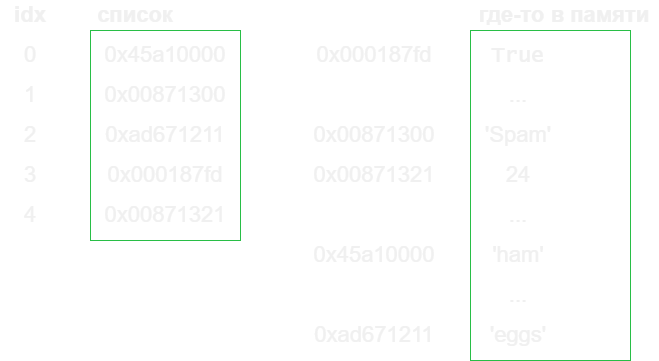

<style>
section {
  font-family: 'Roboto', 'Segoe UI', 'Liberation Sans', 'Helvetica', 'Arial', sans-serif !important;
  font-size: 1.55rem;
  padding: 3.5rem;
  justify-content: start;
}
</style>


<p align="center">
  
</p>


<center>


<br>

<h1 style="font-size: 3.rem"> Python для задач химической технологии </h1>

<br>

<h2 style="font-size: 2.rem"> Лекция 1.2 - Структуры данных: списки </h2>

<br>

Вячеслав Алексеевич Чузлов

к.т.н., доцент ОХИ ИШПР ТПУ 

</center>


---

<!-- paginate: true -->

# Списки

<div class='columns'>

- Являются упорядоченными коллекциями произвольных объектов
- Поддерживают доступ к элементам по индексу
- Имеют переменную длину и произвольную степень вложенности
- Являются - <span style='color: #ffb600;'>*изменяемыми*</span> последовательностями
- Представляют собой массивы ссылок на объекты

<center>



</center>

</div>

> Элементы списка расположены подряд, а значения, на которые они ссылаются, могут находиться где угодно в памяти.

---

# Основные операции со списками

<center>

| Операция | Описание |
| --- | --- |
|`a = []`|Создание пустого списка|
|`a[i]`|Индекс элемента списка|
|`a[i][j]`|Индекс элемента вложенного списка|
|`a[i:j]`|Срез|
|`len(a)`|Длина списка|
|`a1 + a2`|Конкатенация (объединение двух списков)|
|`x in a`|Проверка вхождения|
|`a.append(5)`|Добавление элемента в конец списка|
|`a.extend([10, 20, 30])`|Добавление нескольких элементов в конец списка|

</center>

---

# Инициализация и индексация списков

- В Python список (list) – это <span style="color: #ffb600;">**упорядоченная** **изменяемая**</span> (mutable) коллекция объектов. 
- Список создается из заданных объектов, разделенных запятыми, и помещается между квадратными скобками `[]`. Создание пустого списка: `lst0 = []` или `lst0 = list()`.
- Списки могут содержать объекты любого типа: строки, числа или другие списки.

```python
lst1 = [1, 'two', 3.14, 0]
a = 4
lst2 = [2, a, -0.1, lst1 , True]
print(lst2)  # [2, 4, -0.1, [1, 'two', 3.14, 0], True]
```

- Любой элемент можно извлечь из списка по индексу:

```python
print(lst1[2])  # 3.14
print(lst2[-1])  # True
print(lst2[3][1])  # two
```

---

# Изменяемость списков

> В отличие от строк, которые нельзя изменить после определения, списку **можно** **присваивать** другие элементы:

```python
print(lst1)  # [1, 'two', 3.14, 0]
lst1[2] = 2.72
print(lst1)  # [1, 'two', 2.72, 0]
print(lst2)  # [2, 4, -0.1, [1, 'two', 2.72, 0], True]
```

**Обратите** **внимание**: изменился не только список `lst1`, но и список `lst2` (который содержит `lst1` как элемент).

<div class="columns">

<div>

```python
q1 = [1, 2, 3]
q2 = q1
q1[2] = 100
print(q1)  # [1, 2, 100]
print(q2)  # [1, 2, 100]
```

</div>

<div>

- Переменные `q1` и `q2` ссылаются на один и тот же объект списка;
- Инструкция `q1[2] = 100` изменяет одно из значений этого объекта; 

</div>


</div>

- Список `q2` продолжает указывать на тот же объект списка, поэтому отображает все его изменения. 


---

# Методы списков

Некоторые часто используемые методы списков:

<center>

|Метод|Описание|
|:-|:-|
|`append(element)`|Добавляет `element` в конец списка|
|`extend(list2)`|Расширяет список с использованием элементов из списка `list2`|
|`index(element)`|Возвращает наименьший индекс списка, содержащего element|
|`insert(index, element)`|Вставляет в список `element` по индексу `index`|
|`pop()`|Удаляет и возвращает последний элемент из списка|
|`reverse()`|Изменяет порядок элементов списка на обратный|
|`remove(element)`|Удаляет первое вхождение `element` из списка|
|`sort()`|Сортирует список|

</center>

---

# Методы списков

<center>

|Метод|Описание|
|:-|:-|
|`copy()`|Возвращает копию списка|
|`count(element)`|Возвращает количество элементов, равных `element`, в списке|

</center>

```python
q = []
q.append(4)
print(q)  # [4]
q.extend([6, 7, 8])
print(q)  # [4, 6, 7, 8]
q.insert(1, 5)  # вставка 5 по индексу 1
print(q)  # [4, 5, 6, 7, 8]
q.remove(7)
print(q)  # [4, 5, 6, 8]
i = q.index(8)  # элемент 8 расположен по индексу 3
print(i)  # 3
```

---

# Базовые операции со списками

- Списки являются <span style='color: #ffb600'>*последовательностями*</span>, поэтому поддерживают многие операции, характерные для строк.
 - Например, для списком определены операторы `+` и `*`. Данные операторы, также как и в
случае со строками, означают конкатенацию и повторение, только возвращают в качестве результата новый список, а не строку.

```python
# Длина списка
print(len([1, 2, 3, 4, 5]))  # 5

# Конкатенация
a = [1, 2, 3, 4, 5]
b = [6, 7, 8, 9, 10]
print(a + b)  # [1, 2, 3, 4, 5, 6, 7, 8, 9, 10]

# Повторение
print(['Hi!'] * 5)  # ['Hi!', 'Hi!', 'Hi!', 'Hi!', 'Hi!']
```

---

# Итерация по спискам

Списки поддерживают все операции над последовательностями, которые применялись к строкам, включая инструменты итерации:

- Проверка вхождения элемента в список:
```python
print(3 in [1, 2, 3])  # True
```

- Итерация по элементам списка при помощи цикла `for`:
```python
for x in [1, 2, 3]:
    print(x, end=' ')
```
    1 2 3

---

# Генераторы списков (list comprehension)

<span style="color: #ffb600;">**Генераторы списков**</span> – это способ создания нового списка с применением выражения к каждому элементу последовательности (по факту в любом итерируемом объекте).

```py
xlist = [1, 2, 3, 4, 5, 6]
x2list = [x ** 2 for x in xlist]
print(x2list)  # [1, 4, 9, 16, 25, 36]

```

- Генераторы списков записываются более кратко и выполняются чуть быстрее.

```python
x2list = []
for x in xlist:
    x2list.append(x ** 2)
```

- В сложных случаях лучше использовать цикл `for` из-за его более высокой читаемости.


---

# Генераторы списков

- Генератор списка также может содержать условные выражения:

```python
x2list = [x ** 2 for x in xlist if x % 2]  # только нечетные x
print(x2list)  # [1, 9, 25]
```
- Если требуется более сложное отображение значений из исходной последовательности, то необходимо поместить выражение `if`...`else` перед циклом `for`:

```python
 xvalues = [x ** 2 if x % 2 else x ** 3 for x in xlist]  # x ** 2 для нечетных, x ** 3 для четных x
 print(xvalues)  # [1, 8, 9, 64, 25, 216]
```

- Строки, кортежи и объекты `range` могут использоваться для генерации списков:

```python
print([x ** 3 for x in range(1, 10)])  # [1, 8, 27, 64, 125, 216, 343, 512, 729]
print([w.upper() for w in 'abc xyz'])  # ['A', 'B', 'C', ' ', 'X', 'Y', 'Z']
```

---

# Генераторы списков

- Генераторы списков могут содержать <span style='color:#ffb600'>*вложенные циклы*</span> в виде серии операторов `for`:

```python
res = [x + y for x in 'abc' for y in 'lmn']
print(res)  # ['al', 'am', 'an', 'bl', 'bm', 'bn', 'cl', 'cm', 'cn']
```

Понять такое выражение проще, если преобразовать в форму вложенного цикла `for`. Ниже показан эквивалентный, но более медленный способ достижения того же результата:

```python
res = []
for x in 'abc':
    for y in 'lmn':
        res.append(x + y)
print(res)  # ['al', 'am', 'an', 'bl', 'bm', 'bn', 'cl', 'cm', 'cn']
```
> Генераторы списков предназначены для простых видов итерации. Для более сложных случаев структуру с операторами `for`, вероятно, будет легче понять и модифицировать в будущем.

---

# Вложенность списков

- Внутри списков могут содержаться вложенные списки или объекты других типов.
- Матрицы в Python можно представить в виде вложенных списков. Пример матрицы $3 \times 3$:

```py
matrix = [[10, 20, 30], [40, 50, 60], [70, 80, 90]]
```

- Если указать один индекс, то будет получена целая строка, а при указании двух индексов
будет возвращен элемент строки:

```py
print(matrix[1])  # [40, 50, 60]
print(matrix[2][0])  # 70
matrix = [[10, 20, 30],
          [40, 50, 60],
          [70, 80, 90]]
print(matrix[1][1])  # 50
```

---

# Изменение списков

- Так как списки – <span style='color:#ffb600'>*изменяемый*</span> тип объектов, для них определены операции, которые могут модифицировать объект списка <span style='color:#ffb600'>*на месте*</span>.
- Операции модифицирования списков изменяют объект списка напрямую, перезаписывая
его старое значение, без необходимости создания новой копии, как в случае работы со
строками.

### Присваивание по индексам и срезам

```python
a = ['spam', 'Spam', 'SPAM!']

# Присваивание по индексу
a[1] = 'eggs'
print(a)  # ['spam', 'eggs', 'SPAM!']

# Присваивание по срезу
a[:2] = ['eat', 'more']
print(a)  # ['eat', 'more', 'SPAM!']
```

---

# Изменение списков

Примеры присваиваний по срезу

```python
a = [10, 20, 30]

# Замена/вставка
a[1:2] = [4, 5]
print(a)  # [10, 4, 5, 30]

# Вставка (ничего не заменяется)
a[1:1] = [60, 70]
print(a)  # [10, 60, 70, 4, 5, 30]

# Удаление (ничего не добавляется)
a[1:2] = []
print(a)  # [10, 70, 4, 5, 30]

# Вставка на место :0, пустой срез в начале
a[:0] = [1, 2, 3]
print(a)  # [1, 2, 3, 10, 70, 4, 5, 30]

# Вставка на место len(a): пустой срез в конце
a[len(a):] = [4, 5, 6]
print(a)  # [1, 2, 3, 10, 70, 4, 5, 30, 4, 5, 6]
```

---

# Сортировка элементов списка

- Для сортировки элементов списка по возрастанию достаточно вызвать метод `sort()`.
- Метод `sort()` изменяет исходный список на месте используя стандартные критерии сравнения Python (и возвращает `None`):

```py
a = [5, 2, 3, 1, 4]
a.sort()
print(a)  # [1, 2, 3, 4, 5]

a = [10, 5, 4, 20, 50]
x = a.sort()
print(x)  # None
print(a)  # [4, 5, 10, 20, 50]
```

---

# Метод `sort()`

- Отсортировать можно те списки, элементы которых можно сравнить друг с другом:

```py
a = ['a', 'B', 'C', 'b', 'c', 'A']
a.sort()
print(a)  # ['A', 'B', 'C', 'a', 'b', 'c']

a = [[1, 2, 3], [3, 2, 1], [2, 3, 1]]
a.sort()
print(a)  # [[1, 2, 3], [2, 3, 1], [3, 2, 1]]

a = [1, [20.5, 10], 'A', ‐5]
a.sort()  # TypeError: '<' not supported between instances of 'list' and 'int'
```

---

# Дополнительные сведения о методе `sort()`

- Аргумент `reverse` позволяет сортировку по убыванию, а параметр `key` принимает функцию с одним аргументом, возвращающую значение, используемое при сортировке.


```py
a = [‐10, 5, 20, ‐3, 10]
a.sort()  # Сортировка с учетом знака
print(a)  # [‐10, ‐3, 5, 10, 20]

a.sort(reverse=True)  # Сортировка в порядке убывания
print(a)  # [20, 10, 5, ‐3, ‐10]

a.sort(key=abs)  # Сортировка без учета знака
print(a)  # [‐3, 5, ‐10, 10, 20]

a.sort(key=abs, reverse=True) # Изменение порядка сортировки
print(a)  # [20, ‐10, 10, 5, ‐3]
```

---

<style scoped>
  section {
    justify-content: center;
    font-size: 25px;
    
  }
</style>

<!-- _paginate: skip -->


<center>


<br>


# Благодарю за внимание!


telegram-чат дисциплины: 
https://t.me/+Vf4x3T5uteVmMzYy


</center>
