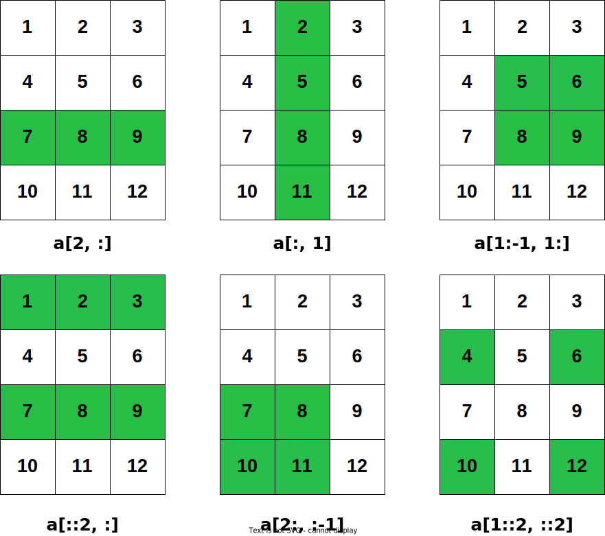

<!-- СМYК (75,0,100,0), RGB (40,190,70)

СМYК (0,0,0,100), RGB (0,0,0) -->

<!-- СМYК (0,33,93,0), RGB (255,182,0)

 СМYК (0,84,45,0), RGB (255,68,96)

 СМYК (72,59,0,0), RGB (101,115,255) -->

<style>
section {
  font-family: 'Roboto', 'Segoe UI', 'Liberation Sans', 'Helvetica', 'Arial', sans-serif !important;
  font-size: 1.55rem;
  padding: 3.5rem;
  justify-content: start;
}
</style>


<br>
<br>

# Python для задач химической технологии


## Лекция №3 - Введение в бибилиотеку NumPy
<br>
<br>
Вячеслав Алексеевич Чузлов

к.т.н., доцент ОХИ ИШПР ТПУ 

---

<!-- paginate: true -->

# Введение

<div class="columns">

<div>

- Библиотека NumPy (**Num**erical **Py**thon – «числовой Python») предоставляет набор эффективных инструментов для хранения и работы с данными.
- Массивы библиотеки NumPy отдаленно напоминают списки Python, однако обеспечивают намного более эффективное хранение и выполнение операций с данными при росте размера массивов.
- Массивы библиотеки NumPy формируют ядро практически всей экосистемы утилит для работы с большими данными (BigData) в Python.

</div>

<div>


> По установившейся традиции, большинство пользователей импортируют пакет NumPy, используя сокращение `np`:

```py
>>> import numpy as np
```

</div>

</div>

---

<style scoped>
  section {
    justify-content: center;
    font-size: 30px
  }
</style>


# Создание массивов NumPy

<!-- _paginate: skip -->


---

# Создание массивов NumPy

- Для того, чтобы создать объект массива NumPy из объекта списка Python, можно использовать функцию `np.array`:

```pycon
>>> import numpy as np
>>> np.array([1, 3, 5, 4, 2]) # Массив целочисленных значений
array([1, 3, 5, 4, 2])
```

- В отличие от стандартных списков Python, массивы NumPy могут содержать элементы только одного типа. Если типы элементов не совпадают, NumPy сделает попытку повышающего приведения типов:

```pycon
>>> np.array([3.14, 4, 2, 3, 2.71])
array([3.14, 4. , 2. , 3. , 2.71])
```

---

# Создание массивов NumPy

- В тех случаях, когда требуется явно задать тип результирующего массива, необходимо воспользоваться ключевым аргументом `dtype`:

```pycon
>>> np.array([1, 3, 5, 4, 2], dtype='float32')
array([1., 3., 5., 4., 2.], dtype=float32)
```

<br>

- В отличие от списков, массивы NumPy можно явным образом описать как многомерные:

```pycon
>>> np.array([range(i, i + 3) for i in [2, 4, 6]])
array([[2, 3, 4],
       [4, 5, 6],
       [6, 7, 8]])
```

---

# Создание массивов NumPy

> Массивы больших размеров эффективнее генерировать с помощью встроенных методов.

- Создаем массив целых чисел длины $10$, заполненный <mark>нулями</mark>:

```pycon
>>> import numpy as np
>>> np.zeros(10, dtype=int)
array([0, 0, 0, 0, 0, 0, 0, 0, 0, 0])
```
<br>

- Создадим массив размером $3 \times 5$ значений с плавающей точкой, заполненный <mark>единицами</mark>:

```pycon
>>> np.ones((3, 5), dtype=float)
array([[1., 1., 1., 1., 1.],
       [1., 1., 1., 1., 1.],
       [1., 1., 1., 1., 1.]])
```

---

# Создание массивов NumPy

- Создадим массив размером $3 \times 5$, заполненный значением $2.98$:

```pycon
>>> np.full((3, 5), 2.98)
array([[2.98, 2.98, 2.98, 2.98, 2.98],
       [2.98, 2.98, 2.98, 2.98, 2.98],
       [2.98, 2.98, 2.98, 2.98, 2.98]])
```

- Создадим массив, заполненный линейной последовательностью, начинающейся с $0$ и заканчивающейся $20$ (<mark>не включая</mark>), с шагом $2$ (аналогично встроенной функции `range()`):

```pycon
>>> np.arange(0, 20, 2)
array([ 0, 2, 4, 6, 8, 10, 12, 14, 16, 18])
```

- Создадим массив из <mark>пяти</mark> значений, *равномерно* располагающихся между $0$ и $1$:

```pycon
>>> np.linspace(0, 1, 5)
array([0. , 0.25, 0.5 , 0.75, 1. ])
```

---

# Создание массивов NumPy

- Создадим массив размером $3 \times 3$ равномерно распределенных случайных значений от $0$ до $1$ (<mark>не включая</mark>):

```pycon
>>> np.random.random((3, 3))
array([[0.28303209, 0.54071726, 0.93183376],
       [0.02403954, 0.92295936, 0.62619599],
       [0.06875703, 0.61762719, 0.47795471]])
```

<br>

- Создадим массив размером $3 \times 3$ случайных целых чисел в интервале $[0; 10)$

```pycon
>>> np.random.randint(0, 10, (3, 3))
array([[3, 6, 7],
       [5, 7, 4],
       [9, 3, 5]])
```

---

# Инициализация массива из функции

- Для создания массива, инициализируемого значениями, которые вычисляются
с помощью некоторой функции, используется метод `np.fromfunction()`,
принимающий в качестве аргументов эту функцию и кортеж, определяющий
форму требуемого массива. 
- Сама функция должна принимать количество аргументов, совпадающее с размерностями создаваемого массива: эти аргументы индексируют каждый элемент, в который функция возвращает значение.

```pycon
>>> import numpy as np
>>> def f(i: int, j: int) -> int:
...     return 2 * j * i
>>> np.fromfunction(f,(4,3))
array([[ 0.,  0.,  0.],
       [ 0.,  2.,  4.],
       [ 0.,  4.,  8.],
       [ 0.,  6., 12.]])
```

---

<style scoped>
  section {
    justify-content: center;
    font-size: 30px
  }
</style>


# Аттрибуты массивов NumPy для интроспекции

<!-- _paginate: skip -->

---

# Аттрибуты массивов NumPy для интроспекции

> Массив NumPy знает свой ранг, форму, размер, тип `dtype` и другие свойства: их можно определить прямо из специальных атрибутов:

```pycon
>>> import numpy as np
>>> a = np.array(((1, 0, 1), (0, 1, 0)))
>>> a.shape  # 2 строки, 3 столбца
(2, 3)
>>> a.ndim  # Ранг (число измерений)
2
>>> a.size  # Общее количество элементов
6
>>> a.dtype
dtype('int64')
>>> a.data
<memory at 0x102387308>
```

---

# Аттрибуты массивов NumPy для интроспекции

|Атрибут|Описание|
|-|-|
|`shape`|Измерения массива: размер массива вдоль каждой из его осей, возвращается как кортеж целых чисел|
|`ndim`|Количество осей (измерений). Обратите внимание: `ndim == len(shape)`|
|`size`|Общее количество элементов в массиве, равное произведению элементов кортежа `shape`|
|`dtype`|Тип данных массива|
|`data`|«Буфер» в памяти, содержащий действительные элементы массива|
|`itemsize`|Размер в байтах каждого элемента|

---

<style scoped>
  section {
    justify-content: center;
    font-size: 30px
  }
</style>


# Стандартные типы данных NumPy

<!-- _paginate: skip -->

---

# Стандартные типы данных NumPy

|<div style="width:200px">Тип данных</div>|Описание|
|-|-|
|`int16`|Целое число (от $–32 \space 768$ до $32 \space 767$)|
|`int32`|Целое число (от $–2 \space 147 \space 483 \space 648$ до $2 \space 147 \space 483 \space 647$)|
|`int64`|Целое число (от $–9 \space 223 \space 372 \space 036 \space 854 \space 775 \space 808$ до $9 \space 223 \space 372 \space 036 \space 854 \space 775 \space 807$)|
|`uint16`|Беззнаковое целое число (от $0$ до $65 \space 535$)|
|`uint32`|Беззнаковое целое число (от $0$ до $4 \space 294 \space 967 \space 295$)|
|`uint64`|Беззнаковое целое число (от $0$ до $18 \space 446 \space 744 \space 073 \space 709 \space 551 \space 615$)|
|`float16`|Число с плавающей точкой с половинной точностью: $1$ бит знак, $5$ бит порядок, $10$ бит мантисса|


---

# Стандартные типы данных NumPy

|<div style="width:200px">Тип данных</div>|Описание|
|-|-|
|`float32`|Число с плавающей точкой с одинарной точностью: $1$ бит знак, $8$ бит порядок, $23$ бита мантисса|
|`float64`|Число с плавающей точкой с удвоенной точностью: $1$ бит знак, $11$ бит порядок, $52$ бита мантисса|
|`complex64`|Комплексное число, представленное двумя $32$-битными числами|
|`complex128`|Комплексное число, представленное двумя $64$-битными числами|

<div class="columns">

<div>

При создании массива тип данных можно указывать с помощью строк:
```pycon
np.zeros(10, dtype='int16')
``` 

</div>

<div>

или соответствующих объектов библиотеки NumPy:
```pycon
np.zeros(10, dtype=np.int16)
```

</div>

</div>

---

<style scoped>
  section {
    justify-content: center;
    font-size: 30px
  }
</style>


# Доступ к элементам массива NumPy

<!-- _paginate: skip -->

---

# Индексация элементов массива NumPy

- В одномерном массиве обратиться к $i$-му (считая с $0$) значению можно по требуемому индексу в квадратных скобках, по аналогии со стандартными списками:

```pycon
>>> import numpy as np
>>> x1 = np.array([5, 0, 3, 3, 7, 9])
>>> x1[0]
5
>>> x1[4]
7
>>> x1[‐1]
9
>>> x1[‐2]
7
```

---

# Индексация элементов массива NumPy

- Для обращения к элементам матрицы нужно указать кортеж индексов,  разделенных запятыми:

```pycon
>>> x2 = np.array([[3, 5, 2, 4], [7, 6, 8, 8], [1, 6, 7, 7]])
>>> x2
array([[3, 5, 2, 4],
       [7, 6, 8, 8],
       [1, 6, 7, 7]])
>>> x2[0, 0]
3
>>> x2[2, 0]
1
>>> x2[2, ‐1]
7
```

---

# Индексация элементов массива NumPy

- При помощи любой из указанных выше нотаций можно изменять значения элементов массива:

```pycon
>>> x2[0, 0] = 24
>>> x2
array([[24, 5, 2, 4],
       [ 7, 6, 8, 8],
       [ 1, 6, 7, 7]])
```

> Следует помнить, что, в отличие от списков, массивы NumPy имеют фиксированный тип данных. Если вставить в массив <mark>*целых*</mark> чисел значение с <mark>*плавающей точкой*</mark>, оно будет <span style="color:red">**неявно усечено**</span>:

```pycon
>>> x1[0] = 2.71828  # Это значение будет усечено!
>>> x1
array([2, 0, 3, 3, 7, 9])
```

---

<style scoped>
  section {
    justify-content: center;
    font-size: 30px
  }
</style>


# Изменение формы массива

<!-- _paginate: skip -->

---

# Методы `flatten()` и `ravel()`

Предположим, что необходимо «выпрямить» многомерный массив вдоль одной оси. Библиотека NumPy предоставляет для этого два метода: `flatten()` и `ravel()`.

- Оба метода создают одномерный массив в соответствии с его внутренним
порядком элементов (по строкам).
- Метод `flatten()` возвращает независимую копию элементов и в общем случае медленнее, чем метод `ravel()`.
- Метод `ravel()` пытается вернуть **представление** преобразованного в одно измерение массива. 

> <span style="color:rgb(255,182,0)">**Представление массива**</span> – это массив NumPy, который в данном случае имеет форму, отличающуюся от формы исходного массива, но не содержит «собственных» элементов данных: он содержит **ссылки** на элементы другого массива.

---

# Методы `flatten()` и `ravel()`

```pycon
>>> a = np.array([[1, 2, 3], [4, 5, 6], [7, 8, 9]])
>>> b = a.flatten()  # Создает независимую, одномерную копию массива a
>>> b
array([1, 2, 3, 4, 5, 6, 7, 8, 9])
>>> b[3] = 0
>>> b
array([1, 2, 3, 0, 5, 6, 7, 8, 9])
>>> a  # Массив a не изменяется
array([[1, 2, 3],
       [4, 5, 6],
       [7, 8, 9]])
```

> Присваивание массиву `b` не изменяет массив `a`, потому что это абсолютно независимые объекты, которые не используют данные совместно.

---

# Методы `flatten()` и `ravel()`

```pycon
>>> c = a.ravel()
>>> c
array([1, 2, 3, 4, 5, 6, 7, 8, 9])
>>> c[3] = 0
>>> c
array([1, 2, 3, 0, 5, 6, 7, 8, 9])
>>> a
array([[1, 2, 3],
       [0, 5, 6],
       [7, 8, 9]])
```

> Необходимо всегда помнить о том, что хотя метод `ravel()` «работает наилучшим образом», возвращая представление внутренних данных, разнообразные операции с массивами (включая вырезание группы элементов (slicing)) могут оставлять элементы хранящимися в несмежных локациях памяти. 
> В этом случае у метода `ravel()` нет другого выбора, кроме создания копии массива.

---

# Метод `resize()`

- Размер массива может быть изменен (для самого исходного массива) с помощью метода `resize,()` который в качестве аргументов принимает новые значения измерений.

<br>

```pycon
>>> a = np.linspace(1, 4, 4)
>>> print(a)
[1. 2. 3. 4.]
>>> a.resize(2, 2)  # Изменяет форму исходного массива, возвращаемого значения нет
>>> print(a)
[[1. 2.]
 [3. 4.]]
```

---

# Метод `reshape()`

- Метод `reshape()` возвращает <mark>представление</mark> исходного массива с изменением его формы. Исходный массив не изменяется, но оба объекта совместно используют внутренние данные.

<br>

```pycon
>>>  a = np.linspace(1, 4, 4)
>>> b = a.reshape(2, 2)
>>> print(a)
[1. 2. 3. 4.]
>>> print(b)
[[1. 2.]
 [3. 4.]]
>>>  b[0, 0] = -99
>>> print(b)
[[-99. 2.]
 [  3. 4.]]
>>>  print(a)
[-99. 2. 3. 4.]
```

---

# Метод `reshape()`

- Если требуется поместить числа от $1$ до $9$ в таблицу $3 \times 3$:

```pycon
>>> grid = np.arange(1, 10).reshape((3, 3))
>>> print(grid)
[[1 2 3]
 [4 5 6]
 [7 8 9]]
```

> <span style="color:orange">*Размер исходного массива должен соответствовать размеру измененного!*</span>

- Другой часто используемый паттерн изменения формы – преобразование одномерного массива в двумерную матрицу-строку или матрицу-столбец. Для этого можно применить метод `reshape()`, но лучше воспользоваться ключевым словом `newaxis` при выполнении операции среза:

```pycon
>>>  x = np.array([1, 2, 3])
>>> x.reshape((1, 3))  # преобразование в вектор-строку
array([[1, 2, 3]])
```

---

# Метод `reshape()`

```pycon
>>> x[np.newaxis, :]  # Преобразование в вектор‐строку посредством newaxis
array([[1, 2, 3]])
>>> x.reshape((3, 1))  # Преобразование в вектор‐столбец с помощью reshape
array([[1],
       [2],
       [3]])
>>> x[:, np.newaxis]  # Преобразование в вектор‐столбец посредством newaxis
array([[1],
       [2],
       [3]])
```

---

# Транспонирование массива

- Метод `transpose()` возвращает представление массива с транспонированными осями. Для двумерного массива это обычная операция транспонирования матрицы:

```pycon
>>> a = np.linspace(1, 6, 6).reshape(3, 2)
>>> a
array([[1., 2.],
       [3., 4.],
       [5., 6.]])
>>> a.transpose()  # Или просто a.T
array([[1., 3., 5.],
       [2., 4., 6.]])
```

- Транспонирование одномерного массива возвращает этот же неизмененный массив:

```pycon
>>> b = np.array([100, 101, 102, 103])
>>> b.T
array([100, 101, 102, 103])
```

---

# Объединение массивов

- Слияние, или объединение, двух массивов в библиотеке NumPy выполняется в основном с
помощью функций `np.concatenate()`, `np.vstack()` и `np.hstack()`.
- Функция `np.concatenate()` принимает на входе кортеж или список массивов в качестве
первого аргумента:


```pycon
>>> x = np.array([1, 2, 3])
>>> y = np.array([3, 2, 1])
>>> np.concatenate([x, y])
array([1, 2, 3, 3, 2, 1])
```

- Можно объединять более двух массивов одновременно:

```pycon
>>> z = [99, 99, 99]
>>> print(np.concatenate([x, y, z]))
[ 1 2 3 3 2 1 99 99 99]
```

---

# Объединение массивов

- Для объединения двумерных массивов можно также использовать `np.concatenate()`:

<br>

```pycon
>>> grid = np.array([[1, 2, 3], [4, 5, 6]])
>>> np.concatenate([grid, grid])  # слияние по первой оси координат
array([[1, 2, 3],
       [4, 5, 6],
       [1, 2, 3],
       [4, 5, 6]])
>>> np.concatenate([grid, grid], axis=1)  # слияние по второй оси координат
array([[1, 2, 3, 1, 2, 3],
       [4, 5, 6, 4, 5, 6]])
```

---

# Объединение массивов

- Для работы с массивами с различающимися измерениями удобнее и понятнее использовать функции `np.vstack()` (вертикальное объединение) и `np.hstack()` (горизонтальное объединение):

<br>

```pycon
>>> x = np.array([1, 2, 3])
>>> grid = np.array([[9, 8, 7], [6, 5, 4]])
>>> np.vstack([x, grid])  # Объединяет массивы по вертикали
array([[1, 2, 3],
       [9, 8, 7],
       [6, 5, 4]])
>>> y = np.array([[99], [99]])  #  Объединяет массивы по горизонтали
>>> np.hstack([grid, y])
array([[ 9, 8, 7, 99],
       [ 6, 5, 4, 99]])
```

---

# Разделение массивов

- Противоположные операции `np.vsplit()`, `np.hsplit()` и `np.dsplit()` разделяют один массив на несколько массивов по строкам, столбцам или «в глубину».

- В дополнение к ссылке на разделяемый массив эти методы требуют аргумента, определяющего, как должен разделяться массив. Если этот аргумент представлен одним целым числом, то массив разделяется на указанное количество массивов равного размера вдоль соответствующей оси.

```pycon
>>> a = np.arange(6)
>>> a
array([ 0, 1, 2, 3, 4, 5])
>>> np.hsplit(a, 3)
[array([0, 1]), array([2, 3]), array([4, 5])]
```

- Здесь можно видеть, что возвращается <mark>*список*</mark> объектов массивов.

---

# Объединение и разделение массивов

- Если вторым аргументом является последовательность целочисленных индексов, то массив разделяется по этим индексам:

```pycon
>>> a
array([0, 1, 2, 3, 4, 5])
>>> np.hsplit(a, (2, 3, 5))
[array([0, 1]), array([2]), array([3, 4]), array([5])]
```

> Здесь последовательность целочисленных аргументов  – то же самое, что список <br> `[a[:2], a[2:3], a[3:5], a[5:]]`. В отличие от группы функций `np.hstack()` и т.д., возвращаемые массивы являются представлениями исходных данных.


---

<style scoped>
  section {
    justify-content: center;
    font-size: 30px
  }
</style>


# Срезы массивов: доступ к подмассивам


<!-- _paginate: skip -->


---

# Срезы массивов: доступ к подмассивам

- Синтаксически срезы массивов NumPy соответствуют срезам стандартных списков Python: `x[начало:конец:шаг]` <br> при этом любое из значений можно не указывать, тогда по умолчанию будут приняты следующие значения: `начало = 0`, `конец = размер соответствующего измерения`, `шаг = 1`.

#### Одномерные подмассивы

```pycon
>>> x = np.arange(10)
>>> x
array([0, 1, 2, 3, 4, 5, 6, 7, 8, 9])
>>> x[:5]
array([0, 1, 2, 3, 4])
>>> x[4:7]
array([4, 5, 6])
```

---

# Срезы массивов: доступ к подмассивам

- Массив индексируется кортежем целых чисел, и, как для последовательностей Python, отрицательные индексы отсчитываются от конца оси.
- Срезы и определение шага для них также поддерживаются аналогичным образом. Но следует особо отметить, что операция вырезания группы элементов из массива NumPy возвращает представление (view), а не копию данных, как для списков Python. Для одномерных массивов существует только один индекс:

```pycon
>>> a = np.linspace(1, 6, 6)
>>> print(a)
[1. 2. 3. 4. 5. 6.]
>>> a[1:4:2]  # Элементы a[1] и a[3] (с шагом 2)
array([2., 4.])
>>> a[3::-2]  # Элементы a[3] и a[1] (с шагом -2)
 array([4., 2.])
```

---

# Срезы массивов: доступ к подмассивам

- Для многомерных массивов индекс существует по каждой оси. 
- Если необходимо выбрать каждый элемент по конкретной оси, то нужно заменить ее индекс на один столбец:

```pycon
>>> a = np.linspace(1, 12, 12).reshape(4, 3)
>>> a
array([[ 1.,  2.,  3.],
       [ 4.,  5.,  6.],
       [ 7.,  8.,  9.],
       [10., 11., 12.]])
>>> a[3, 1]
11.0
>>> a[2, :]  # Все элементы в третьей строке
array([7., 8., 9.])
>>> a[:, 1]  # Все элементы во втором столбце
array([2., 5., 8., 11.])
>>> a[1:-1, 1:]  # Средние строки, начиная со второго столбца
array([[5., 6.],
       [8., 9.]])
```

---

# Срезы массивов: доступ к подмассивам

<div style="width:800px; margin:0 auto;">



</div>


---


# Срезы массивов: доступ к подмассивам

- Специализированная форма записи в  виде многоточия (`...`) удобна для массивов высокого ранга: в  индексе она представляет столько столбцов, сколько необходимо для указания всех оставшихся осей. 

Например, для четырехмерного массива:
  
`a[3, 1, ...]` равнозначно `a[3, 1, :, :]`

`a[3, ..., 1]` равнозначно `a[3, :, :, 1]`


> Синтаксис с символами двоеточия и многоточия работает и для присваивания:


```pycon
>>> a[:, 1] = 0  # Для всех элементов во втором столбце установить значение ноль
>>> print(a)
[[ 1. 0.  3.]
 [ 4. 0.  6.]
 [ 7. 0.  9.]
 [10. 0. 12.]]
```

---

# Сложное индексирование

- Массивы NumPy можно также индексировать последовательностями, которые не являются простыми кортежами целых чисел, а именно другими списками, массивами целых чисел и  кортежами кортежей. 
- Такое «продвинутое индексирование» создает новый массив с  собственной копией исходных данных, а не представление:

```pycon
>>> a = np.linspace(0., 0.5, 6)
>>> print(a)
[0. 0.1 0.2 0.3 0.4 0.5]
>>> ia = [1, 4, 5]  # Список индексов
>>> print(a[ia])
[0.1 0.4 0.5]
>>> ia = np.array(((1, 2), (3, 4)))
>>> print(a[ia])  # Массив, формируемый по заданным индексам
[[0.1 0.2]
 [0.3 0.4]]
```

---

# Сложное индексирование

- Можно проиндексировать многомерный массив с помощью многомерных массивов индексов:

```pycon
>>> a = np.linspace(1, 12, 12).reshape(4, 3)
>>> print(a)
[[ 1.  2.  3.]
 [ 4.  5.  6.]
 [ 7.  8.  9.]
 [10. 11. 12.]]
>>> ia = np.array(((1, 0), (2, 1)))
>>> ja = np.array(((0, 1), (1, 2)))
>>> print(a[ia, ja])
[[4. 2.]
 [8. 6.]]
```

Здесь создается массив  $2 \times 2$ (форма, определяемая массивами индексов) с элементами <br> `a[1, 0]`, `a[0, 1]` в  верхней строке и элементами `a[2, 1]`, `a[1, 2]` в нижней строке.


---

# Сложное индексирование

- Вместо индексации массива с  помощью последовательности целых чисел также возможно использование массива логических значений. 
- Элементы `True` такого индексного массива обозначают элементы целевого массива, которые необходимо вернуть:

<br>

```pycon
>>> a = np.array([-2, -1, 0, 1, 2])
>>> ia = np.array([False, True, False, True, True])
>>> print(a[ia])
[-1 1 2]
```

---

# Сложное инддексирование

- Поскольку операции сравнения векторизованы по элементам массивов тоно так же, как математические операции, становится возможным применение полезных приемов:

```pycon
>>> print(a)
[-2 -1 0 1 2]
>>> ib = a < 0
>>> print(ib)
[True True False False False] 
>>> a[ib] = 0  # Замена всех отрицательных элементов нулями
>>> print(a)
[0 0 0 1 2]
```

- В действительности нет необходимости сохранять вспомогательный массив логических значений `ib`, так как инструкция `a[a < 0] = 0` выполняет ту же самую работу:

```pycon
>>> a = np.array([-2, -1, 0, 1, 2])
>>> a[a < 0] = 0
>>> print(a)
[0 0 0 1 2]
```


---

# Срезы массивов создают разделяемые ссылки

- Срезы массивов возвращают <span style="color:rgb(255,182,0)">**разделяемые ссылки**</span> (синонимы), а не <mark>**копии**</mark> данных массива.
- Этим срезы массивов библиотеки NumPy отличаются от срезов списков языка Python (срезы списков создают новые объекты):

```pycon
>>> x = np.random.randint(1, 10, (3, 4))
>>> x
array([[2, 6, 5, 3],
       [3, 4, 4, 4],
       [8, 2, 9, 9]])
```
Получим из него матрицу $2 \times 2$:

```pycon
>>> x2_sub = x[:2, :2]
>>> x2_sub
array([[2, 6],
       [3, 4]])
```

---

# Срезы массивов создают разделяемые ссылки

Теперь, если изменить значения этой матрицы, исходный массив также изменится:

```pycon
>>> x2_sub[0, 0] = 100
>>> x2_sub
array([[100, 6],
       [  3, 4]])
>>> x
array([[100, 6, 5, 3],
       [  3, 4, 4, 4],
       [  8, 2, 9, 9]])
```

---

# Создание копий массивов

> Для создания копии массива существует метод `copy()`:

```pycon
>>> x2_subcopy = x[:2, :2].copy()
>>> x2_subcopy
array([[100, 6],
       [  3, 4]])
```
Теперь, если изменить значения этого подмассива, то исходный массив не изменится:

```pycon
>>> x2_subcopy[0, 0] = 2
>>> x2_subcopy
array([[2, 6],
       [3, 4]])
>>> x
array([[100, 6, 5, 3],
       [ 3, 4, 4, 4],
       [ 8, 2, 9, 9]])
```


---

<style scoped>
  section {
    justify-content: center;
    font-size: 30px
  }
</style>

<!-- _paginate: skip -->


<br>
<br>

# Благодарю за внимание!

<br>
<br>

Вячеслав Алексеевич Чузлов
к.т.н., доцент ОХИ ИШПР
